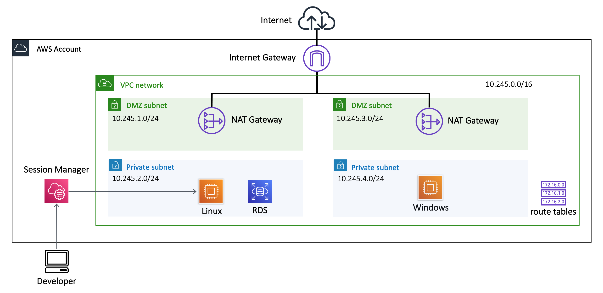
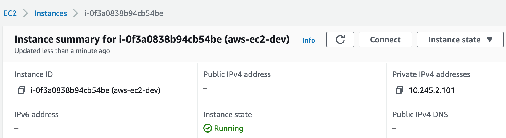
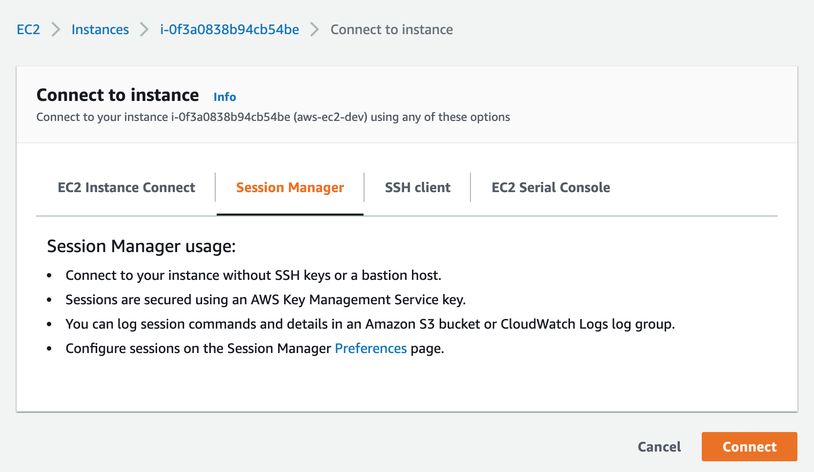
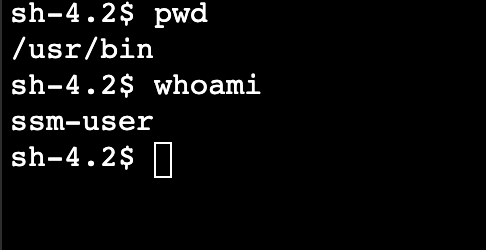
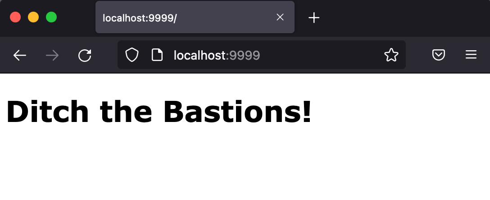
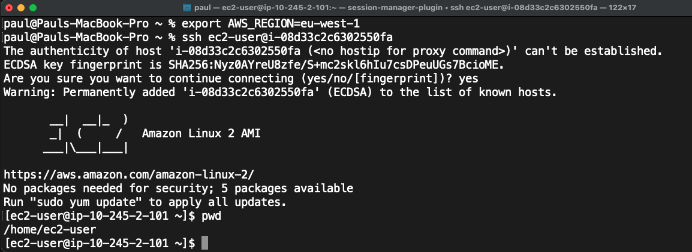
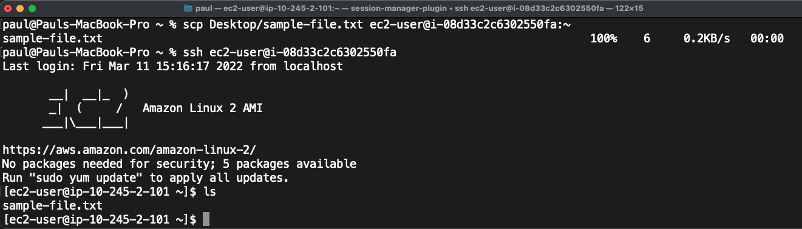
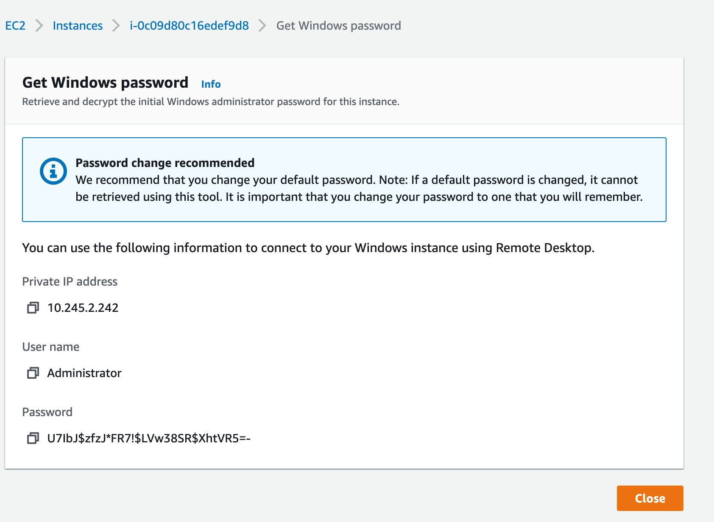

# aws-sessionmanager
AWS EC2 instance using Systems Manager Session Manager



* for testing and demonstration of different Session Manager connection options

## why you should use Session Manager
Session Manager is a **much** more secure way of accessing EC2 instances than a Bastion. 

It can eliminate the risk of SSH / RDP attacks from the public Internet using brute force attack or stolen credentials:

* no need for public IPs on EC2 instances 
* no security group rules allowing inbound SSH or RDP
* no need for SSH keys or SSH passwords
* uses AWS IAM identities
* access logs in S3 and/or CloudWatch Logs
* no need for separate Bastion server
* access EC2 instances in public or private subnets
* can even work without an Internet Gateway using VPC Endpoint
* supports SSH, RDP and port forwarding

## how to deploy
* if deploying from your laptop, duplicate `terraform.tfvars.example`
* rename without the `.example` suffix
* enter details and save
* if deploying via a CI/CD pipeline, enter variable values in your pipeline
```
terraform workspace new dev
terraform plan
terraform apply
```

## do I need a SSH key?
* you don't need a SSH key for Linux options 1, 2 and 3 below
* in this case *exclude* the AWS key pair from your environment
* from a security perspective, it's better not to use SSH keys
* avoids issues with SSH key management
* there is also no S3 / Cloudwatch logging of connections made with SSH keys 

## Linux
5 ways to connect to a Linux EC2 instance:

### 1. Bash shell in AWS console
* A remote SSH session in the AWS console doesn't require a SSH key
* In the AWS Console, EC2, select the instance

* Press Connect
* Choose the Session Manager tab

* You now have a remote bash shell session in your browser



### 2. AWS CLI session from laptop
* allows copying and pasting but not SCP
* ensure you have AWS CLI v2
* [install the AWS CLI Session Manager plugin](https://docs.aws.amazon.com/systems-manager/latest/userguide/session-manager-working-with-install-plugin.html)
* open Terminal
* use default credentials, or export AWS credentials to your session
* replace the example instance ID in the command below:
```
aws ssm start-session --target i-08d33c2c6302550fa --region eu-west-1
```

### 3. port forwarding from laptop to service on the host
* set up port forwarding
```
aws ssm start-session --target i-08d33c2c6302550fa --document-name AWS-StartPortForwardingSession --parameters '{"portNumber":["80"], "localPortNumber":["9999"]}'
```
* browse to `localhost:9999`


### 4a. remote SSH session from laptop - setup
SSH from your laptop allowing use of SCP to transfer files
* requires SSH public key on instance
* ensure you have AWS CLI v2
* [install the AWS CLI Session Manager plugin](https://docs.aws.amazon.com/systems-manager/latest/userguide/session-manager-working-with-install-plugin.html)
* open Terminal
* add the following to your SSH config file at `~/.ssh/config`
```
# SSH over Session Manager
host i-* mi-*
    ProxyCommand sh -c "aws ssm start-session --target %h --document-name AWS-StartSSHSession --parameters 'portNumber=%p'"
```

### 4b. remote SSH session from laptop - usage
SSH from your laptop allowing use of SCP to transfer files
* open Terminal
* use default credentials, or set environment variables for AWS credentials
* if AWS region isn't specified:
```
export AWS_REGION=eu-west-1
```
* connect using SSH from laptop (assuming default SSH key used)
```
ssh ec2-user@i-08d33c2c6302550fa
```


### 5. scp files from laptop to EC2 instance
* SCP from laptop (assuming default SSH key used)
```
scp Desktop/sample-file.txt ec2-user@i-08d33c2c6302550fa:~
```


## Windows
2 ways to connect to Windows servers

### 1. PowerShell via AWS console
* In the AWS Console, EC2, select the Windows instance
* Press Connect
* Choose the Session Manager tab
* Press Connect

  

* You now have a remote PowerShell session in your browser

### 2. RDP via port forwarding
* An AWS key pair is needed to retrieve the administrator password
* Open the AWS console and select the Windows instance
* Select Actions, Security, Get Windows password
* Paste your private key into the box, or browse to the file



* Copy the Windows password
* Start a port forwarding session (replace the example instance ID)
```
aws ssm start-session --target i-0c09d80c16edef9d8 --document-name AWS-StartPortForwardingSession --parameters '{"portNumber":["3389"], "localPortNumber":["3389"]}'
```
* open Microsoft Remote Desktop
* add a new PC with the destination `localhost`


* enter username `Administrator` and paste in the Windows password
* accept the certificate when prompted


* test Internet access using the Edge browser
